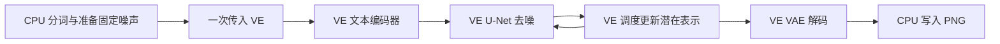

# 图像推理架构计划

最终验收要求三段神经网络计算均在 VE；CPU 分词、输入随机噪声准备、文件编码明确属于主机工作，不宣称所有处理在 VE。P1 可暂用 CPU 文本编码/VAE，但必须标为部分移植，不发布完整 VE 推理结论。初始噪声跨架构直接使用同一导出数组，避免随机数实现差异掩盖数值问题。调度器从固定官方配置读取，时间步/缩放/输出类型逐项匹配 CPU 参考。

卷积采用受预算限制的输入块整理加 SGEMM 或验证后的直接向量内核，避免一次展开全部高分辨率特征。注意力采用稳定归一化的分块实现，避免保存完整大注意力矩阵。FP32 作为吞吐基线，FP64 仅用于局部数值诊断；先禁止量化与不受控快速数学，误差验收后才独立评估精度变化。工作区按生命周期复用，峰值包括权重、活跃中间张量、输入整理与线程局部缓冲；分配请求计数与物理 HBM 使用峰值分别记录。

新增框架在 build/vendor 独立固定依赖，不替换 Qwen 框架或默认执行器；构建与执行脚本接入已有温度守护。三卡独立任务先于同图拆分，后者需要单独通信与吞吐测量。
