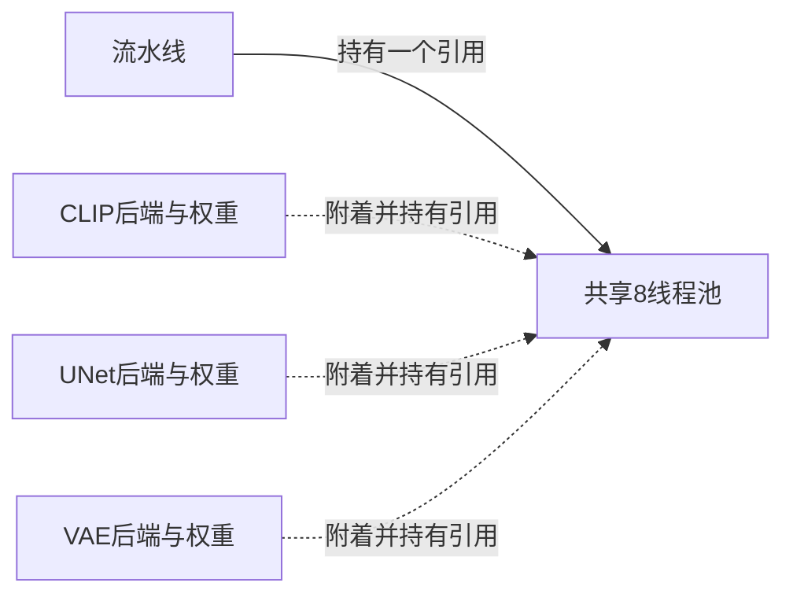

# SD-Turbo 常驻权重共享线程池修正

实施前确认96线程x86_64、ASPEED显示设备、三张VE1与槽1/2/3；前轮诊断和编译均已退出。前轮已实际修复请求解析，常驻首请求在UNet图执行长期无完成标记，多个组件池的资源/调度影响仍为假设，未建立根因。

本轮保留三组件权重和后端，流水线持有单个poll=0、paused=true的8线程池，组件后端顺序附着。引用计数仅由同步主线程修改；流水线引用声明在组件对象之前，异常清理时组件先析构，流水线最后释放。默认原独立组件池路径保持，双请求验收显式启用SD_SHARED_THREADPOOL=1；重载和常驻两臂均固定共享池，以隔离权重收益。模型数学内核不变。

验证入口要求物理池只创建和释放一次，组件附着次数对应实际加载次数，每请求NLC矩阵分配与im2col候选进入及独立CPU数值对照。当前代码已实施，硬件验证未完成，尚无性能结论。构建须温度保护、50%占空比、4CPU核心、-j1，与推理串行。成功后继续同二进制两请求重载/常驻ABBA，多提示与四步、内存回收，最终更新主报告20261009T053636Z-sd-turbo-resident-report.md。

## 所有权检查与构建中间记录

已只读核对固定ggml的ggml_backend_cpu_free：释放CPU上下文与work_data，不销毁外部threadpool。因此引用由流水线/VeSdBackend显式管理，组件析构不会隐式销毁共用线程。引用计数只用于当前同步主线程；不能据此宣称并发线程安全。构建任务45509仍活跃，温度轨迹持续记录；中间最高CPU75°C、VE0 44.125°C，未触及警告。最终峰值与风扇汇总以完成日志为准。

## 厂商线程配置参考

[NEC VEOS NUMA Mode Guide，4.3节](https://sxauroratsubasa.sakura.ne.jp/documents/guide/pdfs/VEOS_NUMA_Mode4PartitioningMode_E.pdf)说明线程配置应匹配运行节点的可用核心，Pthread示例用实际affinity mask计数。该文档不证明本机诊断等待的根因，也不证明本机NUMA模式；未更改NUMA、亲和性或风扇配置。本轮先保持已验证8线程配置，减少同时持有的计算池数量；须以完整推理和数值对照判定修正是否有效。

## 资源所有权

组件按CLIP、UNet、VAE顺序执行。三组件全加载后引用数为4；关闭三个组件后剩流水线引用1，流水线最后释放到0并销毁池。每请求独立输出工作区，UNet请求末尾释放计算调度器，权重保留；当前不是并发组件调度。

## 候选配置边界

常驻验证显式要求SD_SHARED_THREADPOOL=1及SD_PERSISTENT_THREADPOOL=1；主入口对resident且非shared的组合提前报错，避免再次进入已观察到长期无完成标记的独立多池诊断配置。默认重载路径不变。此约束围绕当前候选生命周期设计，不代表已证明旧等待的根因。入口修改发生在其编译前，未修改正在编译的组件或共享头文件。

## 逐请求计时定义

请求计时从请求环境配置与输出工作区创建开始，到所有诊断数组、PNG输出及ggml输出工作区释放完成后结束。首次请求包括懒加载，后续常驻请求不含重复加载；进程总耗时还包括清单解析、共享池初始化、最终组件权重/后端关闭及池销毁。RGB等局部容器析构在请求标记后、下一请求开始前，进程计时包含它们。不是无诊断生产服务延迟。入口显式work.reset避免输出工作区清理被排除在逐请求指标之外。

## 首轮双请求完整硬件验证通过

公开摘要：[首轮常驻结果](../results/20261009T064545Z-sd-turbo-resident-initial.json)。槽1，同一个共享8线程池，单提示单步两次完整生成；首次93.044285秒、加载3个组件，第二次32.080039秒、加载0个组件。每请求五项CPU独立对照全部通过；噪声和时间步另外严格核对，全部七个FP32轨迹及PNG两次按位相等。共享池只创建与释放一次，工作区逐请求清理，权重退出后关闭。初始验收绑定保留的原检查器SHA与快照；随后只加强非有限参考值的拒绝和ABBA全passed检查，不改变模型数学。

连续节点内存698次采样，最高10,299,392 KiB（9.8223 GiB），启动和结束均128 MiB基线；目标0.2秒、最大实际采样间隔0.46677秒。属于全节点离散最高值，包括运行时与其他进程，不能宣称模型独占或瞬时峰值。构建CPU/VE最高76°C/44.125°C，测试75°C/50.5°C，未触及警告线。97个可读风扇状态/策略通道无变化；仍不能据零sysfs转速与不可用BMC断言物理策略。

本轮未进行同二进制重载ABBA，93→32是首次与后续请求两个不同阶段，不报告为优化百分比。多提示、四步与更长连续运行尚未验收，候选不默认启用。下一步补齐ABBA及多样正确性，再进行下一轮优化。

后续瓶颈证据：热请求CLIP阶段11.349668秒，图执行1.489683秒；源码每次run新建CLIPTokenizer。差额不能直接全部归因于分词初始化，后续需细分构造、编码与图准备计时，再验证词表/分词器复用；现阶段只作为待测方向。

## 验证收尾与正式对照启动

203个待提交修改/新增文件通过隐私、Python/shell语法、文档链接与术语表列数检查；56项当前构建哈希一致，git diff --check通过。两个完整请求的初始数值/复用验证已完成，正式重载/常驻ABBA四进程对照已在温度保护内串行启动，未同时执行其他重型任务。多提示、四步和ABBA完成前仍不默认推荐常驻，未提交/推送。

## 正式验收整理准备

record_sd_resident_result.py已准备：要求4次同二进制/检查器ABBA、每请求全部CPU比较通过、原始数组/PNG哈希一致及跨模式按位一致；复算计时均值和百分比，不能只信汇总状态。额外要求6个不同提示单步与两个四步请求、当前12算子回归，以及六提示/四步的完整内存轨迹和温度日志。脚本尚未用于最终发布，缺失的硬件证据不能跳过。正式ABBA首个重载进程已完成，候选第二个进程开始，后续仍串行执行。

## ABBA进行中

同二进制首个重载进程与首个常驻进程已完成且每请求数值检查通过；目前已验证的原始进程耗时为reload 185.987425秒, resident 125.043802秒。四次尚未完成，不能给最终均值/收益百分比；仍保持来源与检查器冻结，串行温度保护。最终整理另要求重复四步请求的16个原始数组与PNG按位一致。

## 同二进制ABBA完成，多样验收待完成

[ABBA原始均值与范围](../results/20261009T070218Z-sd-turbo-resident-abba-initial.json)。

| 指标 | 重载 | 常驻 | 延迟下降 |
| --- | --- | --- | --- |
| 两请求全进程均值 | 185.969821秒 | 124.917195秒 | 32.83% |
| 首请求均值 | 92.874680秒 | 92.352646秒 | 0.56%，不作明显首次收益结论 |
| 后续请求均值 | 92.700776秒 | 32.042397秒 | 65.43% |
| 全节点离散采样最高值 | 5.3223GiB | 9.8223GiB | 常驻增加内存，不作为速度指标 |

ABBA两个进程/臂、每进程两个同提示单步请求；40项CPU阶段对照通过，所有对应原始FP32数组与PNG跨四次逐字节一致，实际权重加载重载3/3、常驻3/0。每进程只创建/释放一次共享池。四个内存采样都完成，退出均恢复128MiB节点基线；全节点离散值不是模型独占或瞬时峰值。正式对照CPU最高77°C、VE最高50.875°C，97个可读风扇状态/策略通道无变化，物理策略仍未证明。

结果含权重加载和诊断输出，未控制文件缓存，不是生产服务延迟或一般模型收益。六提示单步已在温度保护下串行启动，四步和当前12算子回归待运行；完成全部扩展门槛前候选仍不默认推荐。热CLIP阶段仍有未细分开销，下一轮再测分词器初始化/编码并验证复用，不与本轮权重常驻改动混合计时。

## 六提示常驻通过

build/results/20261009T070008Z-sd-resident已完成6个不同提示单步请求，30项CPU对照通过，首次加载3组件、后续每请求0次；共享池创建/释放各一次。CPU最高74°C、VE最高53°C，97个可读状态/策略通道无变化。内存采样完整，退出恢复128MiB。四步重复请求已在温度保护下串行启动，尚未完成。

## 四步重复请求通过

build/results/20261009T070558Z-sd-resident完成两次四步请求，每次11项CPU对照、噪声/时间步核对通过，16个诊断数组和PNG两请求按位一致。首次109.585814秒、后续49.039301秒，未做四步ABBA，不引用优化百分比。CPU最高76°C、VE最高52.5°C，97状态通道无变化。当前12项算子回归正在温度保护下串行执行。
