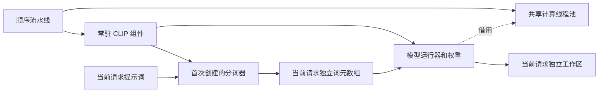

# CLIP 分词器复用优化报告与过程

已完成计时定位：三请求每次构造9.43–9.48秒，编码0.022–0.040秒，15项CPU对照通过。下一候选在常驻CLIP组件内惰性保留分词器，SD_REUSE_TOKENIZER开关默认关闭；临时路径每请求构造。分词器与组件一同销毁，不保存提示词输出；编码可能改变映射，仍需不同提示词和重复原提示词验证。只支持当前顺序生命周期，未声称并发安全。

检查器增加显式--tokenizer request/resident和逐请求构造标记断言。计划先构建、三请求候选验收，再同二进制ABBA，仅切换分词器复用，并补六提示/四步对照。收益尚未测量。温度与风扇执行同项目策略，重型任务串行；上一测试和构建均已正常结束。硬件支持由本轮槽1三次完整推理证实，显示GPU未用于计算。

性能前后、候选正确性、候选温度/风扇：待验证。此前计时构建和测试峰值分别CPU73/74°C、VE43.25/51.5°C；风扇可读通道无变化，物理策略未确认。每轮更新本报告并独立发布结果。

## 对照工具准备

已扩展ABBA工具增加--comparison tokenizer：四个进程均固定权重常驻及共享8线程池，仅切换分词器request/resident/resident/request，每进程两请求。校验模式、实际构造标记、二进制/检查器哈希、全部CPU对照及对应数组/PNG相等，记录每臂节点内存，保存基准脚本快照。原权重对照默认保留。候选构建会话66734仍活跃，未并行启动推理；收益待硬件实测。惰性初始化即首次使用才构造，已记录术语表。

构建中间监控最高CPU79°C、VE44.5°C，尚未触及CPU80°C警告线；温度守护持续有效，最终峰值待结束。新改代码隐私扫描、Python语法、术语表列数、git diff --check通过。没有提交或推送。

新增复用候选发布器：必须完整通过四臂ABBA、0/1/0状态检查、六提示及两次四步；重新核对当前56文件清单、检查器/基准快照、原始数组/PNG、实际权重加载、正有限计时和全部CPU误差，重算性能百分比，要求所有额外测试及四臂内存采样完整且结束恢复基线。候选默认关闭；更快才推荐验证范围内使用。发布器语法检查通过，真实验收待运行，当前构建仍活跃。

## 后续矩阵路径只读检查

固定ggml-blas源码对OpenBLAS/BLIS/NVPL提供线程数设置，当前NLC Generic编译路径无对应设置；核心直接调用cblas_sgemm，构建链接libblas_sequential。本机也存在libblas_openmp版本，但尚未链接或执行，不能宣称性能提升或兼容性通过。下一阶段可独立对照顺序/多线程NLC及实际矩阵分项耗时；当前不改共享池或线程配置，先完成分词器复用验收。构建会话66734连续轮询仍活跃，最高CPU79°C、VE44.5°C。

## 构建完成，候选三请求运行中

构建会话66734退出0，56文件清单已捕获；最终CPU79°C、VE44.5°C，97风扇状态通道无变化，物理策略未确认。已启动受温度/风扇/内存监控的候选验证会话79367，--mode resident --tokenizer resident --cases 0,1,0，冻结CPU参考集不重生成。完整结果未结束，尚未宣称候选正确或更快。

## 三请求复用验证通过，正式对照运行中

15项CPU独立对照通过；返回原提示词的七组FP32数组及PNG与首次逐字节一致，已重新核对实际文件哈希。构造标记1/0/0，后续请求构造计时约49微秒，耗时22.416/22.384秒；当前没有同二进制对照结论，不能把首次与后续差异全部解释为本轮收益。测试CPU78°C、VE51.5°C，97风扇通道无变化，物理策略未确认。节点采样最高9.8223GiB，退出恢复128MiB。公开初验：[三请求复用计时](../results/20261009T074425Z-sd-turbo-tokenizer-profile.json)。

正式ABBA已启动会话53976，固定常驻权重，只切换分词器复用，两请求/进程。六提示与四步仍待完整验收，不默认启用。本轮源码/检查器及基准在对照期间不再修改。

## ABBA中间检查

第一臂每请求构造已完成，10项CPU对照通过；第二臂复用已启动，同一会话53976仍活跃。中间最高CPU75°C、VE51.25°C，最终峰值待守护结束。当前仅一臂完成，不能发布性能百分比；源码/检查器/基准未改变。下一阶段NLC并行官方依据与计划另行留档，当前不运行新负载。

第二臂复用已完成，累计20项CPU对照通过，第三臂复用已启动；四臂未完成，收益与最终温度仍待汇总。226个待提交文本文件的隐私、Python语法、Markdown本地链接及术语表列数检查通过，git diff --check通过；本轮未提交/推送。

## 分词器复用所有权

开启复用时，分词器由CLIP组件的unique_ptr持有，首次请求创建，组件关闭时析构；词元与输入张量仍每请求独立，不缓存提示词输出。关闭复用时，由run内临时unique_ptr持有，当前请求结束释放。组件只在同步主线程顺序访问；编码内部映射可变，未验证任意提示词或并发安全。三请求初验0/1/0证明当前两种提示词顺序未发生结果残留；六提示及四步仍待验收。

ABBA第三臂已完整结束，累计30项CPU对照通过；第四臂每请求构造正在运行。全部四臂和守护总结完成前不发布百分比，也不启用默认候选。

## ABBA硬件完成，指标恢复后验证

四臂均实际执行结束，40项CPU对照通过，七组FP32数组与PNG四臂逐字节相同。汇总脚本缺少第二个均值，发生TypeError；已修复未来运行，并用独立恢复脚本重读四份原始summary、检查器快照、数组/PNG哈希、内存完成/回收和执行基准SHA，保存summary-before-recovery及原脚本快照。未重跑或替换原硬件记录；原外层会话53976因汇总退出1，四个原生子运行都退出0，恢复状态和原因明确记录。

固定权重常驻，仅切换分词器复用，两个进程/臂：两请求进程均值126.046→115.861秒（延迟下降8.08%）；后续32.539→22.407秒（下降31.14%）；首次92.981→92.679秒，无明显收益。缓存未控制且含诊断，不推广生产服务。CPU77°C、VE51.875°C；97风扇状态通道无变化，物理策略未确认；四臂退出均回到128MiB。公开初步结果：[ABBA指标恢复](../results/20261009T075631Z-sd-turbo-tokenizer-abba-initial.json)。

六提示候选验收会话55800已启动，持续温度/风扇/节点内存监控；四步待测，尚不推荐或默认启用候选。最终发布器会核验原基准快照与恢复脚本/原摘要哈希，不能将旧执行脚本SHA冒充修复后代码。

## 六提示验收通过

六提示按0至5顺序完成，30项CPU对照通过，首次92.577秒，后续22.430至22.485秒；首次加载3个组件并构造分词器，后续均不加载、不重新构造。最大归一化L2误差1.3368099e-05。节点采样最高9.8223GiB，退出回到128MiB。测试CPU74°C、VE53.25°C，97风扇状态通道无变化，实际物理策略未确认。六提示未做独立ABBA，不据此计算新的百分比。会话55800正常退出0；两次四步候选会话64771已串行启动，其他负载未并行运行。
